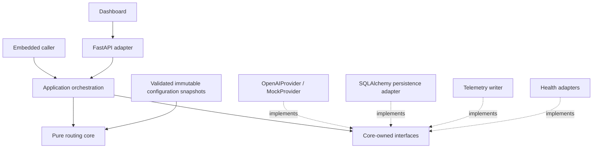

# Architecture v1

Status: Accepted architecture contract; Phase 1 routing and Phase 2 classifier /
single-invocation provider adapters are complete. Task orchestration remains
future work. See [Phase 2 report](phase-2-report.md).

## Mission and ownership

Select the lowest-cost OpenAI execution path likely to successfully complete a
task within quality, reliability, capability, latency, and budget constraints.
Optimize **Effective Cost per Successful Task**, including failed work, recovery,
tools, classification, and validation. The cheapest token price need not produce
the cheapest successful task.

[Routing policy](routing-policy-v1.md) owns decision semantics;
[configuration](configuration.md) defines the versioned values and their schema
contract. [Telemetry](telemetry.md) owns measurement definitions.
[Implementation phases](implementation-spec-v1.md) govern when these contracts
become executable. Accepted [ADRs](decisions/) settle durable choices, not
unresolved calibration, thresholds, deployment, or database-engine details.

## Dependency direction

Both embedded library mode and HTTP service mode use exactly the same routing
engine. FastAPI only translates transport input/output and composes adapters.

The core owns normalized value objects, classification contracts, capability
requirements, complexity aggregation, policy evaluation, and explainable
decisions. It imports neither FastAPI, SQLAlchemy, OpenAI SDK, dashboard code,
nor telemetry transport. Pydantic v2 may validate boundary/configuration objects;
database entities and SDK objects never become core types.

Application orchestration owns execution, bounded recovery, validation,
idempotency, deadlines, budget reservations, and event delivery through ports.
Adapters own network I/O, credentials, persistence and health probes. The existing
`src/model_router/` scaffold is preserved; exact future module layout can evolve
without changing this dependency direction. Phase 1 implements the pure routing
and configuration boundaries; this document remains the broader contract.

## Canonical routing pipeline

1. Normalize request.
2. Determine capability requirements.
3. Classify task.
4. Calculate complexity.
5. Filter incapable models.
6. Apply task-family floors/modifiers.
7. Apply consequence + validation policy.
8. Apply context constraints.
9. Apply application budget constraints.
10. Apply model/system health state.
11. Select model.
12. Select reasoning effort.
13. Select validation level.
14. Estimate expected cost.
15. Emit explainable RouteDecision.

Steps 7–10 establish validation requirements and feasible model/effort candidates
before final selection. Budget filtering necessarily uses preliminary cost bounds;
step 14 records the final estimate and its assumptions. Steps 11–13 finalize a
jointly feasible path, not three independent choices that can invalidate each
other. If final accounting fails a constraint, reselect within the finite
candidate set or return a structured rejection. Never emit an infeasible route
as executable.

The classifier classifies the task and supplies component scores, flags, and
confidence. It must not return a selected model, tier, or final reasoning effort.
The policy engine recomputes the total and owns final routing. Phase 1 uses
caller-supplied classifications/fixtures; Phase 2 adds a classifier adapter.

## Normalized request contract

| Field | Contract |
| --- | --- |
| task_id, trace_id | Nonempty opaque identifiers, generated at ingress if absent; stable across retries. |
| application_id | Optional opaque overlay/telemetry key; never a core application-specific branch. |
| input | Task content/reference held for execution; excluded from normal telemetry. |
| requirements | Explicit capabilities, output/schema expectations, tool requirements, and success criteria. |
| classification | Optional task_family, task_subclass, component scores, confidence, and structured flags; provenance identifies caller, fixture, or classifier version. |
| consequence | Explicit low/moderate/high/critical class; never silently infer low from missing data for live execution. |
| context | Estimated input, cached input, cache writes, output including reasoning allowance, and evidence for cache/retrieval assumptions. |
| constraints | Optional tighter tier bounds, task cost ceiling, deadline, and requested validation requirements. |
| execution_controls | Idempotency key, authorized tool/side-effect scope, and application approval evidence. |
| policy_version | Optional requested immutable version; otherwise pin the activated version at task admission. |

Missing requirements needed for a safe decision produce a typed input error or
routing rejection. Unknown capability is not supported capability. Free-form
subclass/flags are validated against configured policy inputs before matching.
Live adapters may derive classification, but a model's proposed route is ignored.

## RouteDecision contract

| Field | Contract |
| --- | --- |
| task_id, trace_id, decision_id | Correlation identifiers; a task can have multiple decisions. |
| policy_version | Immutable policy/bundle reference, never just “latest.” |
| catalog_version, pricing_version, budget_version, validation_version | Exact snapshots used by the decision; pricing_version identifies its cost quote. |
| application_overlay_version | Nullable immutable overlay reference; effective configuration hash accompanies it. |
| task_family, task_subclass | Configured family; nullable subclass for specialization/telemetry. |
| complexity_score | Integer total equal to the sum of all components. |
| complexity_components | All named bounded integer components from routing configuration. |
| selected_model_alias, provider_model_id, model_tier | Logical model, provider identifier, and configured tier. |
| reasoning_effort | One supported value for the selected model, independent of tier. |
| validation_level | V0–V3 with required checks/evaluator/domain bindings. |
| classifier_confidence | Number in [0,1], with classification provenance/version. |
| estimated_cost | Currency, nullable amount, status (known/partial/unavailable), breakdown, pricing version, token/cache assumptions, and cost scope. |
| rationale_codes | Nonempty list of configured machine-readable codes. |
| rationale_details | Rule IDs, removed candidates, constraint values, floor waivers, and estimate uncertainty; optional prose is supplementary. |
| health_snapshot_id | Nullable for offline routing; required provenance for health-aware live decisions. |
| execution_requirements | Approval/evidence/restrictions, deadline, budgets, and unresolved prerequisites. |
| executable | False for preview routes with unresolved execution prerequisites. |

An impossible route returns a separate RouteRejection with task/trace IDs,
policy/configuration references, normalized failure type, violated constraints,
rationale codes, and details. It never fabricates a model or a zero cost.
A preview may select a candidate with an incomplete cost estimate but must set
`executable=false`; a finite budget cannot be certified with unknown charges.

## Ports and execution contracts

`ModelProvider` is a core-owned interface, not an OpenAI SDK type. Its Phase 2
`execute(ProviderRequest) -> ProviderResult | ProviderFailure` operation accepts
a pinned model ID, effort, text content, structured output requirements,
timeout/output bounds, and correlation IDs. It returns normalized
output, timing, token/cache usage, response ID, provider model
identity where returned, and normalized failure details. Execution orchestration,
not the provider adapter, owns routing/escalation and side-effect authorization.

`OpenAIProvider` translates one invocation to the OpenAI Responses API using the
official SDK; retries and truncation are explicitly disabled. Structured output
uses the SDK's strict text format and preserves the envelope before parsing.
`MockProvider` supplies scripted outputs, usage, failures and timing without
network or credentials. Adapter conformance tests must use both the same input
contracts and normalized failure semantics. The initial provider scope is OpenAI;
the abstraction does not authorize cross-provider routing. Tools, streaming and
task execution are outside this Phase 2 port. See the
[frozen interfaces](phase-2-interfaces.md) and [ADR 0011](decisions/0011-phase-2-classifier-provider-boundary.md).

The Phase 2 Classifier port returns the existing Classification with versioned
provenance and provider accounting; the model never selects the route. Future
ports are Validator, ToolExecutor, HealthSnapshotSource,
TaskRepository, BudgetLedger, and TelemetrySink. Core events contain facts;
orchestration persists/delivers them. All execution paths, including failed and
abandoned attempts, eventually emit telemetry. A durable pending-event mechanism
is required before production; its transaction/storage design is unresolved
([ADR 0007](decisions/0007-storage-boundary.md)).

A task outcome is succeeded, failed, cancelled, or awaiting_approval; in-flight
states are accepted/running. An attempt outcome does not determine task success
alone. Required validation and execution restrictions must be satisfied before
the task becomes succeeded. Shadow output cannot affect the caller's result.

## Configuration lifecycle

Load and validate an entire referenced bundle before activation; reject unknown
keys, invalid references, unsupported efforts, conflicting hard constraints,
and inconsistent component/band definitions. Retain the last valid activated
bundle on an invalid reload, or fail readiness when none exists. Atomically pin
policy, catalog, overlay, budget and validation versions per task, including
subsequent decisions. New policy activation affects new tasks; it does not
rewrite historical or in-flight policy. Provider tariffs are external facts:
refresh their independently versioned snapshot before each paid invocation,
re-estimate/recheck remaining budget and record any new decision quote. Retain
both the original estimate and the execution-time pricing version.

The current YAML files are draft contract data, not activated live configuration.
Verified public metadata is distinct from account access and runtime health.
Registry/pricing versions can change independently of routing algorithms; every
effective bundle and historical cost retains the exact referenced snapshots.

## V1 non-goals

Cross-provider routing; autonomous routing-policy rewriting; reinforcement
learning; unrestricted self-modification; evaluator calls for every task;
unnecessary task micro-categories; Kubernetes; Kafka; microservices; enterprise
IAM; premature distributed observability; unbounded agent execution.
